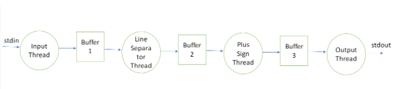

# Author: Nag Balijepalli
Multithreaded processing
- To Compile: **gcc --std=gnu99 -lpthread -g -o line_processor main.c**
- To Run: **./line_processor < input1.txt > output.txt**
-------
Note:
This program will take in a file input and start processing immediately following a producer-consumer process until it hits a "STOP". It will change every "++" to a '^' and only print 80 charectors per line.

#### Process Flow:
- Thread 1: take user input.
  > buffer #1
- Thread 2: remove '/n' to make processing easier
  > buffer #2
- Thread 3: remove "++" to a "^"
  > buffer #3
- Thread 4: ouptut 80 charectors per line.
  > stdout (File I/O)

