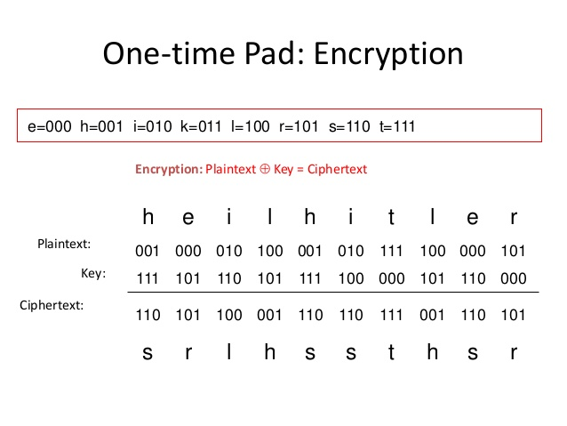

# Author: Nag Balijepalli
 One Time Pads (Client & Server -> Encryption)
------
- To compile: **compileall**
- To run test script: **./p5testscript <RANDOM PORT> <RANDOM PORT> <redirection or stdout>**
-----

-----
Description: Program will encrypt and decrypt plaintext into ciphertext, using a key, in exactly the same fashion as above, except it will be using modulo 27 operations: your 27 characters are the 26 capital letters, and the space character. The program uses Network IPC API's such as socket, connect, bind, listen & accept.
>The TestScript will run encryption, decryption, concurrency between client and server.
